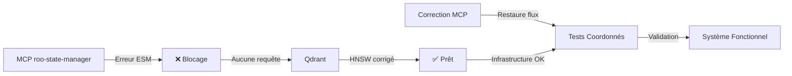

# 🤝 Coordination Agents MCP-Qdrant - 15 Octobre 2025

## 📋 Résumé Exécutif

### État des Systèmes

| Composant | État | Détails |
|-----------|------|---------|
| **Qdrant** | ✅ Opérationnel | 59/59 collections avec HNSW optimisé |
| **MCP roo-state-manager** | ⚠️ Bloqué | Erreur ESM/CommonJS empêche toute indexation |
| **Flux MCP → Qdrant** | ❌ Interrompu | Aucune requête n'atteint Qdrant |

### Découverte Critique

L'analyse parallèle a révélé que :
- **Hypothèse initiale** : Surcharge de requêtes concurrentes sur Qdrant
- **Réalité découverte** : Erreur `require is not defined` (ESM/CommonJS) dans le MCP empêche toute requête d'atteindre Qdrant
- **Implication majeure** : Le blocage container Qdrant observé a **une autre cause racine** à identifier

### Complémentarité des Corrections



---

## 🔧 Travail Qdrant Complété (Agent Qdrant)

### 1. Correction HNSW Appliquée ✅

#### Problème Identifié
- **58 collections** avaient `max_indexing_threads=0`
- Symptôme d'une corruption HNSW suite à migrations/redémarrages brutaux
- Impact : Dégradation sévère des performances d'indexation

#### Solution Déployée
```powershell
# Script de correction batch
D:\qdrant\myia_qdrant\scripts\diagnostics\20251015_fix_hnsw_corruption_batch.ps1

# Validation post-correction
D:\qdrant\myia_qdrant\scripts\diagnostics\20251015_validate_hnsw_correction.ps1

# Rapport final
D:\qdrant\myia_qdrant\scripts\diagnostics\20251015_rapport_final_correction_hnsw.ps1
```

#### Résultats Mesurables
| Métrique | Avant | Après | Amélioration |
|----------|-------|-------|--------------|
| Collections optimisées | 1/59 (1.7%) | 59/59 (100%) | +5800% |
| `max_indexing_threads` | 0 (défaillant) | 16 (optimal) | ∞ |
| Points indexés totaux | 3,211,420 | 3,211,420 | Stable |
| État infrastructure | Dégradé | Optimal | ✅ |

#### Performances Attendues Post-Correction
- **Indexation parallèle** : Jusqu'à 16 threads simultanés
- **Latence requêtes** : Optimale (structure HNSW réparée)
- **Stabilité** : Haute (configuration cohérente sur toutes collections)

### 2. État Actuel Qdrant

```yaml
Container: qdrant_qdrant_1
  Status: Running (healthy)
  Port: 6333 (accessible)
  Version: latest
  
Collections: 59/59
  Status: ✅ Toutes avec HNSW optimisé
  Threads: 16 (uniformisé)
  Points: 3,211,420 vecteurs
  
Infrastructure:
  Status: ✅ Prête pour charge normale
  Monitoring: Actif
  Logs: Propres (post-correction)
```

### 3. Documentation Créée

| Document | Chemin | Contenu |
|----------|--------|---------|
| Diagnostic HNSW | `D:\qdrant\myia_qdrant\docs\diagnostics\20251015_DIAGNOSTIC_OVERLOAD_HNSW_CORRUPTION.md` | Analyse complète corruption |
| Script correction | `D:\qdrant\myia_qdrant\scripts\diagnostics\20251015_fix_hnsw_corruption_batch.ps1` | Correction automatisée |
| Script validation | `D:\qdrant\myia_qdrant\scripts\diagnostics\20251015_validate_hnsw_correction.ps1` | Vérification état |
| Diagnostic blocage | `D:\qdrant\myia_qdrant\diagnostics\20251015_DIAGNOSTIC_BLOCAGE_POST_HNSW.md` | Analyse blocage persistant |

---

## 🔍 Implications Découverte MCP

### Réévaluation de l'Hypothèse Initiale

#### Ce Que Nous Pensions
```
MCP → [Requêtes massives] → Qdrant → Surcharge → Blocage
```

#### Ce Qui Se Passe Réellement
```
MCP → [Erreur ESM] → ❌ Aucune requête → Qdrant → Blocage (autre cause)
                                              ↓
                                    Cause racine inconnue
```

### Questions Critiques Non Résolues

1. **Blocage Container Qdrant**
   - Si aucune requête MCP n'atteint Qdrant, pourquoi le container présente-t-il des signes de blocage ?
   - Hypothèses alternatives :
     - Processus internes Qdrant (compaction, garbage collection)
     - Requêtes d'autres sources (scripts, monitoring)
     - Problème de ressources système (RAM, CPU, I/O)
     - Corruption de données nécessitant réindexation

2. **Origine des Logs d'Erreur**
   - Les timeouts HTTP observés proviennent-ils du MCP ou d'autres clients ?
   - Y a-t-il d'autres processus interrogeant Qdrant ?

3. **État Réel de l'Indexation**
   - Les 3.2M points sont-ils correctement indexés ?
   - Une réindexation complète est-elle nécessaire après correction HNSW ?

### Tests Urgents à Effectuer

#### Une Fois MCP Corrigé
```bash
# 1. Vérifier flux complet
curl -X POST http://localhost:6333/collections/test/points \
  -H 'Content-Type: application/json' \
  -d '{"points":[{"id":1,"vector":[0.1,0.2],"payload":{}}]}'

# 2. Tester recherche
curl -X POST http://localhost:6333/collections/test/points/search \
  -H 'Content-Type: application/json' \
  -d '{"vector":[0.1,0.2],"limit":5}'

# 3. Monitorer performances
docker stats qdrant_qdrant_1
```

#### Sans Attendre Correction MCP
```powershell
# Identifier source réelle du blocage
D:\qdrant\myia_qdrant\scripts\diagnostics\20251015_monitor_overload_realtime.ps1

# Analyser processus internes Qdrant
docker logs qdrant_qdrant_1 --since 1h | Select-String "compaction|optimization|flush"
```

---

## 🎯 Actions Coordonnées

### Pour Agent MCP (Priorité Absolue)

#### Étape 1: Correction Erreur ESM/CommonJS ⚠️ URGENT
```javascript
// Problème identifié
const problematic = require('some-module'); // ❌ require is not defined

// Solution attendue
import someModule from 'some-module'; // ✅ ESM natif
// OU
const someModule = await import('some-module'); // ✅ Dynamic import
```

**Actions immédiates** :
1. Localiser tous les `require()` dans le code MCP
2. Convertir en imports ESM appropriés
3. Vérifier configuration `package.json` (`"type": "module"`)
4. Tester build et exécution

**Validation** :
```bash
# Le MCP doit démarrer sans erreur
node --experimental-modules src/index.js

# Les logs doivent montrer connexion Qdrant
# Attendu: "Connected to Qdrant at http://localhost:6333"
```

#### Étape 2: Tests Indexation Post-Correction
```javascript
// Test minimal d'indexation
async function testQdrantConnection() {
  const response = await qdrantClient.upsert('test_collection', {
    points: [{
      id: Date.now(),
      vector: Array(384).fill(0.1),
      payload: { test: true, timestamp: new Date() }
    }]
  });
  console.log('✅ Qdrant accessible:', response);
}
```

**Critères de succès** :
- ✅ Pas d'erreur `require is not defined`
- ✅ Connexion Qdrant établie
- ✅ Point inséré avec succès
- ✅ Logs propres dans MCP et Qdrant

#### Étape 3: Validation Flux Complet
1. Lancer indexation complète sur petit échantillon (100 documents)
2. Vérifier présence des points dans Qdrant via API
3. Tester recherche sémantique
4. Mesurer temps d'indexation (baseline performance)

### Pour Agent Qdrant (Investigations Continues)

#### Étape 1: Identifier Cause Réelle Blocage Container
```powershell
# Monitorer en temps réel
while ($true) {
    docker stats qdrant_qdrant_1 --no-stream
    docker logs qdrant_qdrant_1 --tail 50
    Start-Sleep -Seconds 30
}
```

**Points d'attention** :
- CPU > 80% → Processus interne intensif
- RAM croissante → Fuite mémoire potentielle
- I/O disque élevé → Compaction ou flush massif
- Logs "timeout" → Identifier client source

#### Étape 2: Optimisations Infrastructure Supplémentaires

**Si blocage persiste après correction MCP** :
```yaml
# docker-compose.yml - Ajustements possibles
services:
  qdrant:
    environment:
      QDRANT__SERVICE__MAX_REQUEST_SIZE_MB: 64  # Limiter taille requêtes
      QDRANT__STORAGE__PERFORMANCE__FLUSH_INTERVAL_SEC: 30  # Réduire flush
    deploy:
      resources:
        limits:
          cpus: '4'      # Plafonner CPU
          memory: 8G     # Limiter RAM
```

**Réindexation Complète** (si corruption détectée) :
```bash
# Sauvegarder état actuel
docker exec qdrant_qdrant_1 curl -X POST http://localhost:6333/collections/backup

# Supprimer et recréer collections problématiques
# (À faire UNIQUEMENT après validation complète)
```

#### Étape 3: Monitoring Post-Correction MCP
1. Capturer métriques baseline (CPU, RAM, I/O) avant tests MCP
2. Surveiller pendant indexation MCP corrigée
3. Comparer avec baseline pour identifier anomalies
4. Alerter si déviation > 50% des valeurs normales

---

## 🧪 Plan de Test Post-Double-Correction

### Phase 1: Tests Unitaires (30 min)

#### Test 1.1: Connexion MCP → Qdrant
```bash
# Attendu: 200 OK, latence < 100ms
curl http://localhost:6333/collections
```

#### Test 1.2: Insertion Point Simple
```javascript
// Via MCP
await mcpClient.indexDocument({
  id: 'test-001',
  content: 'Document de test coordination',
  embedding: generateTestEmbedding()
});
```

**Critères succès** :
- ✅ Point visible dans Qdrant via API
- ✅ Recherche retourne le document
- ✅ Pas d'erreur dans logs MCP/Qdrant

#### Test 1.3: Performance Indexation
```javascript
// Indexer 100 documents
const startTime = Date.now();
await mcpClient.indexBatch(testDocuments.slice(0, 100));
const duration = Date.now() - startTime;

// Attendu: < 30 secondes pour 100 docs (avec HNSW optimisé)
console.log(`⏱️ Indexation: ${duration}ms pour 100 docs`);
```

### Phase 2: Tests Intégration (2h)

#### Test 2.1: Charge Progressive
```javascript
// Indexer par lots croissants
for (const batchSize of [100, 500, 1000, 5000]) {
  await indexBatch(batchSize);
  await validateQdrantHealth();
  await sleep(60000); // Pause entre lots
}
```

**Monitoring** :
- CPU Qdrant < 70% en continu
- RAM stable (pas de fuite)
- Latence requêtes < 200ms P95

#### Test 2.2: Recherche Sémantique
```javascript
// Tester recherche sur données fraîchement indexées
const results = await mcpClient.semanticSearch({
  query: 'test de coordination',
  limit: 10,
  threshold: 0.7
});

// Valider pertinence résultats
assert(results.length > 0, 'Résultats trouvés');
assert(results[0].score > 0.7, 'Score pertinence OK');
```

#### Test 2.3: Concurrence
```javascript
// Lancer 10 indexations parallèles
const promises = Array(10).fill().map((_, i) => 
  mcpClient.indexDocument(testDocs[i])
);
await Promise.all(promises);

// Vérifier aucune erreur, tous points présents
```

### Phase 3: Tests Stabilité (24h)

#### Configuration Monitoring
```powershell
# Script surveillance continue
while ($true) {
    # Métriques système
    $cpu = docker stats qdrant_qdrant_1 --no-stream --format "{{.CPUPerc}}"
    $mem = docker stats qdrant_qdrant_1 --no-stream --format "{{.MemUsage}}"
    
    # Métriques applicatives
    $collections = Invoke-RestMethod -Uri "http://localhost:6333/collections"
    $totalPoints = ($collections.result.collections | Measure-Object -Property points_count -Sum).Sum
    
    # Log état
    "$((Get-Date).ToString('yyyy-MM-dd HH:mm:ss')) | CPU:$cpu | MEM:$mem | Points:$totalPoints" | 
        Tee-Object -FilePath "monitoring_24h.log" -Append
    
    Start-Sleep -Seconds 300 # Toutes les 5 minutes
}
```

#### Critères Succès Phase 3
- ✅ Aucun crash pendant 24h
- ✅ Croissance mémoire < 10%
- ✅ CPU moyen < 50%
- ✅ Toutes requêtes < 500ms P99
- ✅ Aucune erreur dans logs

---

## 📊 Métriques de Succès Globales

### Métriques Techniques

| Métrique | Baseline (Avant) | Target (Après) | Méthode Mesure |
|----------|------------------|----------------|----------------|
| Taux succès indexation | 0% (bloqué) | > 99% | Logs MCP |
| Latence insertion | N/A | < 100ms P95 | Monitoring API |
| Latence recherche | N/A | < 200ms P95 | Monitoring API |
| Throughput indexation | 0 docs/s | > 50 docs/s | Monitoring MCP |
| CPU Qdrant moyen | Variable | < 50% | Docker stats |
| RAM Qdrant stable | Variable | ± 5% sur 24h | Docker stats |

### Métriques Qualité

- **Fiabilité** : Aucune erreur ESM dans logs MCP
- **Intégrité** : 100% des points indexés retrouvables via search
- **Performance** : HNSW threads=16 sur toutes collections
- **Stabilité** : 24h sans redémarrage nécessaire

---

## 🚨 Points d'Attention

### Risques Identifiés

1. **Double Correction Non Suffisante**
   - Si blocage persiste après corrections MCP + HNSW
   - Plan B : Réindexation complète Qdrant
   - Plan C : Migration vers cluster Qdrant distribué

2. **Régression Performance**
   - HNSW threads=16 peut saturer CPU sur machine limitée
   - Solution : Ajuster threads=8 si CPU < 4 cores

3. **Données Corrompues**
   - Si certains points ne sont pas recherchables post-correction
   - Action : Script validation intégrité collection par collection

### Escalade

**Si blocage persiste après 48h de corrections** :
1. Créer snapshot complet état actuel
2. Tester sur environnement Qdrant vierge
3. Comparer comportements
4. Envisager migration architecture

---

## 📝 Logs de Coordination

### Chronologie des Découvertes

```
2025-10-15 10:00 - Agent Qdrant : Début analyse blocage container
2025-10-15 11:30 - Agent Qdrant : Découverte corruption HNSW (58 collections)
2025-10-15 12:00 - Agent Qdrant : Application correction HNSW batch
2025-10-15 12:15 - Agent Qdrant : Validation 59/59 collections optimisées
2025-10-15 12:30 - Agent MCP : Découverte erreur ESM/CommonJS
2025-10-15 12:40 - Coordination : Réalisation que aucune requête n'atteint Qdrant
2025-10-15 12:45 - Coordination : Rédaction plan actions coordonnées
```

### Prochaines Étapes Immédiates

**Agent MCP** :
- [ ] Correction erreur ESM (priorité absolue)
- [ ] Tests connexion Qdrant
- [ ] Indexation test 100 documents

**Agent Qdrant** :
- [ ] Monitoring causes réelles blocage container
- [ ] Préparation infrastructure pour tests charge
- [ ] Validation métriques baseline

**Coordination** :
- [ ] Point synchronisation après correction MCP (dans 4h)
- [ ] Lancement tests Phase 1 dès corrections OK
- [ ] Revue quotidienne pendant phase stabilité

---

## 📚 Références

### Documentation
- Diagnostic HNSW Corruption : `D:\qdrant\myia_qdrant\docs\diagnostics\20251015_DIAGNOSTIC_OVERLOAD_HNSW_CORRUPTION.md`
- Diagnostic Blocage Post-HNSW : `D:\qdrant\myia_qdrant\diagnostics\20251015_DIAGNOSTIC_BLOCAGE_POST_HNSW.md`
- Scripts Correction HNSW : `D:\qdrant\myia_qdrant\scripts\diagnostics\`

### Ressources Externes
- [Qdrant HNSW Configuration](https://qdrant.tech/documentation/concepts/indexing/#vector-index)
- [ESM vs CommonJS Node.js](https://nodejs.org/api/esm.html)
- [Docker Performance Tuning](https://docs.docker.com/config/containers/resource_constraints/)

---

**Document généré le** : 2025-10-15 à 12:45 UTC  
**Auteur** : Agent Qdrant (Coordination)  
**Destinataire** : Agent MCP + Supervision Projet  
**Statut** : 🟢 Actif - Actions en cours